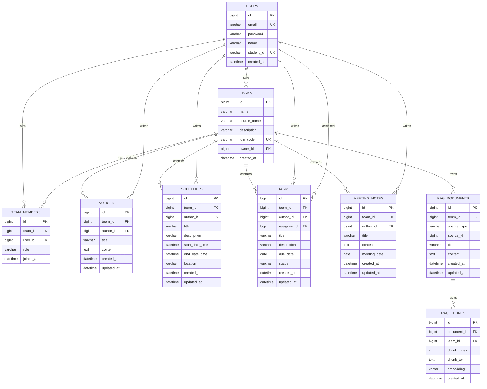

# CampusCrew ERD

## 1. 문서 목적

이 문서는 CampusCrew의 데이터 모델을 고정하기 위한 ERD 문서다.  
엔터티, 관계, 핵심 컬럼, 제약 조건은 이 문서를 기준으로 통일한다.

## 2. ERD

## 3. 테이블 정의

### 3.1 `users`

| 컬럼 | 타입 | 제약 |
| --- | --- | --- |
| `id` | `bigint` | PK |
| `email` | `varchar(100)` | NOT NULL, UNIQUE |
| `password` | `varchar(255)` | NOT NULL |
| `name` | `varchar(20)` | NOT NULL |
| `student_id` | `varchar(10)` | NOT NULL, UNIQUE |
| `created_at` | `datetime` | NOT NULL |

### 3.2 `teams`

| 컬럼 | 타입 | 제약 |
| --- | --- | --- |
| `id` | `bigint` | PK |
| `name` | `varchar(30)` | NOT NULL |
| `course_name` | `varchar(30)` | NOT NULL |
| `description` | `varchar(500)` | NOT NULL |
| `join_code` | `varchar(6)` | NOT NULL, UNIQUE |
| `owner_id` | `bigint` | NOT NULL, FK -> `users.id` |
| `created_at` | `datetime` | NOT NULL |

### 3.3 `team_members`

| 컬럼 | 타입 | 제약 |
| --- | --- | --- |
| `id` | `bigint` | PK |
| `team_id` | `bigint` | NOT NULL, FK -> `teams.id` |
| `user_id` | `bigint` | NOT NULL, FK -> `users.id` |
| `role` | `varchar(20)` | NOT NULL |
| `joined_at` | `datetime` | NOT NULL |

추가 제약:
- `team_id + user_id` 조합은 UNIQUE로 고정한다.

### 3.4 `notices`

| 컬럼 | 타입 | 제약 |
| --- | --- | --- |
| `id` | `bigint` | PK |
| `team_id` | `bigint` | NOT NULL, FK -> `teams.id` |
| `author_id` | `bigint` | NOT NULL, FK -> `users.id` |
| `title` | `varchar(50)` | NOT NULL |
| `content` | `text` | NOT NULL |
| `created_at` | `datetime` | NOT NULL |
| `updated_at` | `datetime` | NOT NULL |

### 3.5 `schedules`

| 컬럼 | 타입 | 제약 |
| --- | --- | --- |
| `id` | `bigint` | PK |
| `team_id` | `bigint` | NOT NULL, FK -> `teams.id` |
| `author_id` | `bigint` | NOT NULL, FK -> `users.id` |
| `title` | `varchar(50)` | NOT NULL |
| `description` | `varchar(500)` | NOT NULL |
| `start_date_time` | `datetime` | NOT NULL |
| `end_date_time` | `datetime` | NOT NULL |
| `location` | `varchar(50)` | NOT NULL |
| `created_at` | `datetime` | NOT NULL |
| `updated_at` | `datetime` | NOT NULL |

### 3.6 `tasks`

| 컬럼 | 타입 | 제약 |
| --- | --- | --- |
| `id` | `bigint` | PK |
| `team_id` | `bigint` | NOT NULL, FK -> `teams.id` |
| `author_id` | `bigint` | NOT NULL, FK -> `users.id` |
| `assignee_id` | `bigint` | NOT NULL, FK -> `users.id` |
| `title` | `varchar(50)` | NOT NULL |
| `description` | `varchar(500)` | NOT NULL |
| `due_date` | `date` | NOT NULL |
| `status` | `varchar(20)` | NOT NULL |
| `created_at` | `datetime` | NOT NULL |
| `updated_at` | `datetime` | NOT NULL |

### 3.7 `meeting_notes`

| 컬럼 | 타입 | 제약 |
| --- | --- | --- |
| `id` | `bigint` | PK |
| `team_id` | `bigint` | NOT NULL, FK -> `teams.id` |
| `author_id` | `bigint` | NOT NULL, FK -> `users.id` |
| `title` | `varchar(50)` | NOT NULL |
| `content` | `text` | NOT NULL |
| `meeting_date` | `date` | NOT NULL |
| `created_at` | `datetime` | NOT NULL |
| `updated_at` | `datetime` | NOT NULL |

### 3.8 `rag_documents`

| 컬럼 | 타입 | 제약 |
| --- | --- | --- |
| `id` | `bigint` | PK |
| `team_id` | `bigint` | NOT NULL, FK -> `teams.id` |
| `source_type` | `varchar(30)` | NOT NULL |
| `source_id` | `bigint` | NOT NULL |
| `title` | `varchar(100)` | NOT NULL |
| `content` | `text` | NOT NULL |
| `created_at` | `datetime` | NOT NULL |
| `updated_at` | `datetime` | NOT NULL |

추가 설명:
- RAG 원본 문서는 공지, 일정, 할 일 설명, 회의록에서 생성한다.
- 같은 원본 데이터가 수정되면 대응되는 RAG 문서도 함께 갱신한다.

### 3.9 `rag_chunks`

| 컬럼 | 타입 | 제약 |
| --- | --- | --- |
| `id` | `bigint` | PK |
| `document_id` | `bigint` | NOT NULL, FK -> `rag_documents.id` |
| `team_id` | `bigint` | NOT NULL, FK -> `teams.id` |
| `chunk_index` | `int` | NOT NULL |
| `chunk_text` | `text` | NOT NULL |
| `embedding` | `vector` | NOT NULL |
| `created_at` | `datetime` | NOT NULL |

추가 설명:
- `embedding` 컬럼은 PostgreSQL의 pgvector 타입을 사용한다.
- 질문 검색 시 같은 `team_id` 범위의 청크만 조회한다.
- 유사도 검색 결과는 최대 3개까지만 사용한다.

## 4. 관계 규칙

- 한 명의 사용자는 여러 팀에 참여할 수 있다.
- 한 팀은 여러 팀원을 가진다.
- 한 팀은 공지, 일정, 할 일, 회의록을 여러 개 가진다.
- 한 팀은 여러 개의 RAG 문서와 RAG 청크를 가진다.
- 공지, 일정, 할 일, 회의록은 모두 팀에 속한다.
- 공지, 일정, 할 일, 회의록은 모두 작성자를 가진다.
- 할 일은 작성자와 담당자를 모두 가진다.
- 팀장은 `teams.owner_id`와 `team_members.role = OWNER`로 동일하게 유지한다.
- RAG 문서는 원본 공지, 일정, 할 일 설명, 회의록과 1:N 청크 관계를 가진다.

## 5. 상태값 규칙

### `team_members.role`
- `OWNER`
- `MEMBER`

### `tasks.status`
- `TODO`
- `IN_PROGRESS`
- `DONE`

## 6. 인덱스 규칙

- `users.email` UNIQUE INDEX
- `users.student_id` UNIQUE INDEX
- `teams.join_code` UNIQUE INDEX
- `team_members(team_id, user_id)` UNIQUE INDEX
- `notices.team_id` INDEX
- `schedules.team_id` INDEX
- `tasks.team_id` INDEX
- `tasks.assignee_id` INDEX
- `meeting_notes.team_id` INDEX
- `rag_documents.team_id` INDEX
- `rag_chunks.team_id` INDEX
- `rag_chunks.document_id` INDEX
- `rag_chunks.embedding` VECTOR INDEX

## 7. 구현 규칙

- 모든 FK는 실제 DB 제약으로 생성한다.
- 삭제 정책은 물리 삭제로 시작한다.
- 팀 삭제 시 하위 공지, 일정, 할 일, 회의록, 팀원 데이터는 함께 삭제한다.
- 사용자 삭제 기능은 현재 구현 범위에서 제외한다.
- 엔터티명은 코드에서 단수형, 테이블명은 DB에서 복수형으로 사용한다.
- RAG 저장 구조는 PostgreSQL + pgvector 기준으로 구현한다.

