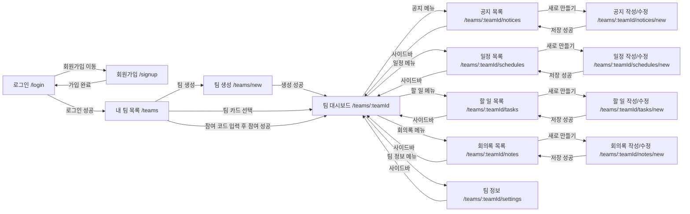
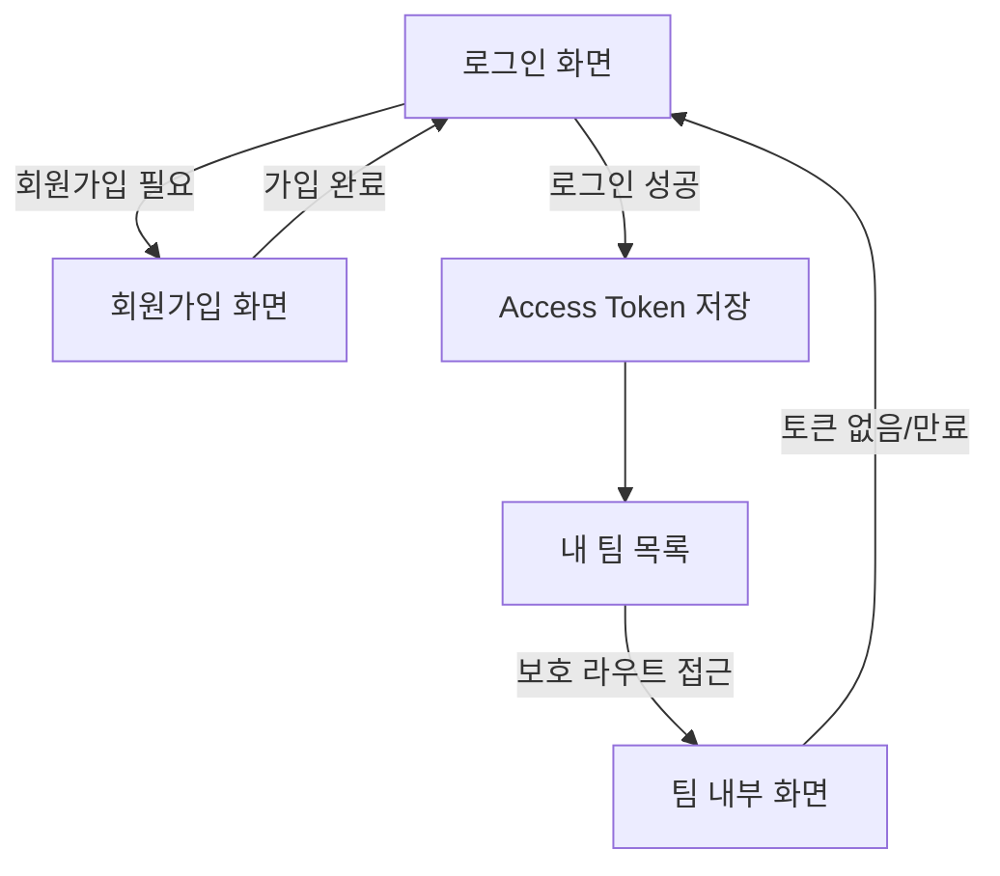
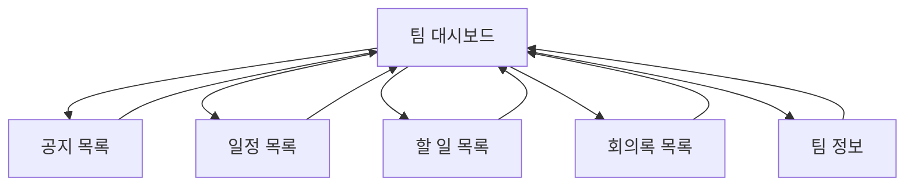
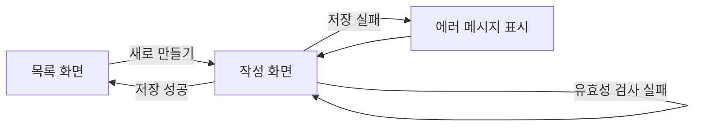
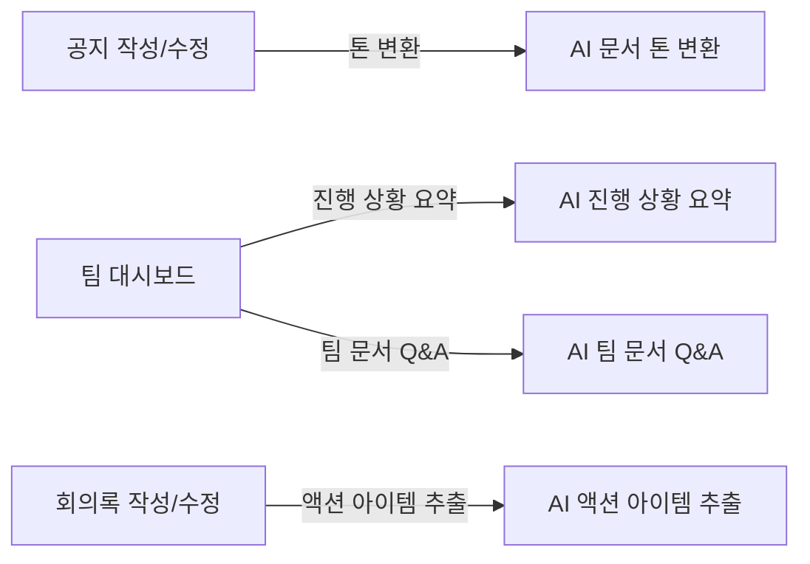

# CampusCrew 화면 흐름도

## 1. 문서 목적

이 문서는 CampusCrew의 화면 이동 흐름을 한눈에 이해하기 위한 시각 자료다.  
상세 입력값과 UI 규칙은 `UI_SPEC.md`를 기준으로 하고, 이 문서는 "어떤 화면에서 어떤 화면으로 이동하는가"를 빠르게 파악하는 용도로 사용한다.

## 2. 전체 화면 흐름

## 3. 인증 흐름

## 4. 팀 내부 네비게이션 흐름

## 5. 작성 화면 공통 흐름

## 6. AI 기능이 붙는 화면

